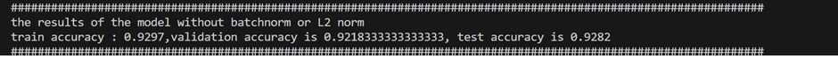
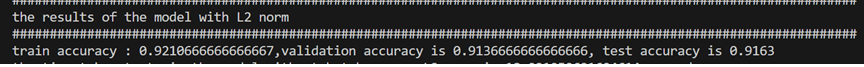
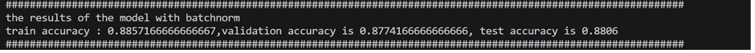

# Implemnting Fully Connected Neural network using numpy

In this code i implmented three diffrent CNN models that differ between human faces, giving an answer if its the same person or not.

## The assigment:
The assigment was to build all required functions using only numpy to create a fully connected neural network
give an array of diffrent layers dimnesion and activation function to callsify Flatten Mnist images correctly 

## The Work:
all the forward and backward propogation functions was build from scrtach.
implented the option of L2 regularization,Batch noramlization and early stopping criteria.

## Testing the work
for testing my work i built a four layer NN that classify the MNIST images using Cross entropy as my objective function, testing the architecture for each combination of with or without L2 regurlarization and batch normalization to see how they effect the preformance.

## The results
**without either L2 or Batchnorm**

**With L2  and Without Batchnorm**

**With Batchnorm and Without L2**

